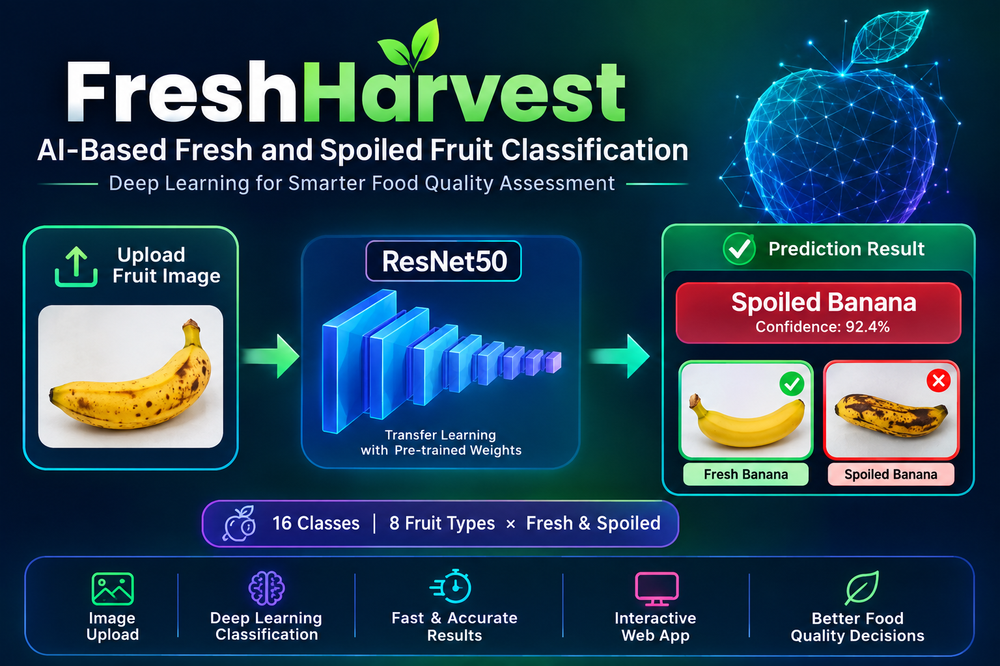
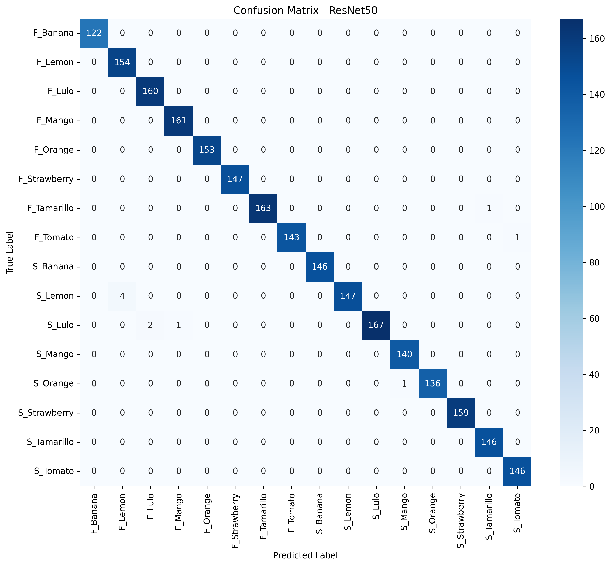
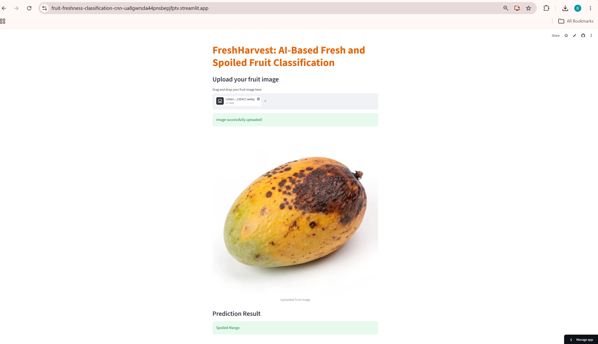
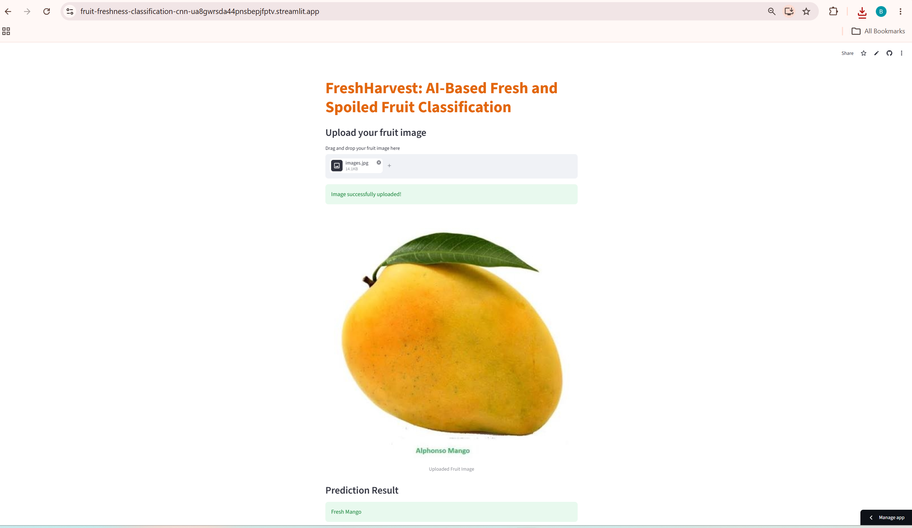

# 🍎 FreshHarvest — AI-Based Fresh & Spoiled Fruit Classification

<p align="center"></p>

<p align="center">
  <strong>Deep Learning • Transfer Learning • Computer Vision • Streamlit</strong>
</p>

FreshHarvest is an end-to-end deep learning project that automates visual fruit freshness inspection using deep learning. The final solution uses **ResNet50 transfer learning** to classify images of eight supported fruits as **Fresh** or **Spoiled**, and provides an interactive **Streamlit** application for image-based prediction.

---
### 🚀 Live Demo

👉 **[Launch FreshHarvest Streamlit App](https://fruit-freshness-classification-cnn-ua8gwrsda44pnsbepjfptv.streamlit.app/)**
---

## 📌 Business Problem

**FreshHarvest Logistics** is a mid-sized company specializing in the warehousing and distribution of fresh fruits and vegetables across California. The company supplies fresh produce to supermarkets and local farmers' markets and aims to maintain high product quality.

The company handles eight types of fruits/vegetables:

- Banana
- Lemon
- Lulo
- Mango
- Orange
- Strawberry
- Tamarillo
- Tomato

However, inconsistent manual quality inspections have created several operational challenges.

### 1. Operational Inefficiency
Manual inspections can be affected by human error, inconsistent lighting conditions, and worker fatigue.

### 2. Business Losses
Incorrect quality assessments can contribute to refund requests, product losses, and damage to brand reputation.

### 3. Customer Complaints
Retailers have reported receiving spoiled or overripe produce, particularly fruits such as strawberries, tomatoes, and mangoes.

---

## 💡 Proposed AI Solution

FreshHarvest proposes an AI-powered visual inspection system integrated into the warehouse conveyor-belt process.

High-speed cameras can capture images of fruit crates as they move through the inspection area. A deep learning model can then analyze the captured images and classify the produce as **Fresh** or **Spoiled**.

### Proposed Workflow

```text
Fruit Crate
    ↓
High-Speed Camera
    ↓
Image Capture
    ↓
Image Preprocessing
    ↓
ResNet50 Deep Learning Model
    ↓
16-Class Classification
    ↓
Fresh / Spoiled Prediction
```

> **Current project scope:** This repository demonstrates the image-classification component and a Streamlit prototype. Physical conveyor-belt and camera integration are proposed future deployment components.

---

# 🎯 Project Objectives

- Automate visual fruit freshness classification.
- Classify eight supported fruit types.
- Build a CNN baseline from scratch.
- Investigate overfitting using training and validation performance.
- Experiment with regularization techniques including batch normalization and dropout.
- Experiment with different numbers of training epochs.
- Reduce training cost using transfer learning.
- Train a ResNet50-based 16-class classifier.
- Evaluate the model on validation and test datasets.
- Analyze class-level performance using a confusion matrix.
- Save the trained model for future inference.
- Build an interactive Streamlit application.
- Provide simple drag-and-drop image upload and prediction.

---

# 🗂️ Dataset

The dataset contains **16,000 images** across 16 classes, representing fresh and spoiled conditions for 8 types of fruits.

- **8 fruit types**
- **2 freshness categories:** Fresh and Spoiled
- **1,000 images per class**
- **16 classes × 1,000 images = 16,000 images**
- Image dimensions: **224 × 224 pixels**

| Fruit / Vegetable | Fresh | Spoiled |
|---|---|---|
| Banana | `F_Banana` | `S_Banana` |
| Lemon | `F_Lemon` | `S_Lemon` |
| Lulo | `F_Lulo` | `S_Lulo` |
| Mango | `F_Mango` | `S_Mango` |
| Orange | `F_Orange` | `S_Orange` |
| Strawberry | `F_Strawberry` | `S_Strawberry` |
| Tamarillo | `F_Tamarillo` | `S_Tamarillo` |
| Tomato | `F_Tomato` | `S_Tomato` |

### Number of Classes

```text
8 fruit types × 2 freshness categories = 16 classes
```

---

# 🧠 Model Development

The project was developed through several stages rather than using transfer learning immediately.

## 1. Custom CNN Baseline

A CNN was first implemented from scratch using convolution, ReLU, max-pooling, flattening, and fully connected layers.

```text
Input Image
     ↓
Conv2D (3 → 32) + ReLU + MaxPool
     ↓
Conv2D (32 → 64) + ReLU + MaxPool
     ↓
Conv2D (64 → 128) + ReLU + MaxPool
     ↓
Flatten
     ↓
Fully Connected Layer
     ↓
16-Class Output
```

The baseline model was trained for different numbers of epochs and evaluated using training and validation accuracy.

---

## 2. Regularization Experiments

Regularization techniques were explored to investigate generalization and overfitting.

### Batch Normalization

A batch-normalized CNN variant was trained and evaluated across multiple epochs.

### Dropout

A CNN variant using **Dropout = 0.2,0.5** was also evaluated.

### Weight Decay

Weight decay was considered as an additional approach for controlling model complexity.

### Early Stopping

Validation performance was monitored to identify the point where additional training no longer consistently improved generalization.

These experiments helped establish that simply increasing the number of epochs does not necessarily improve validation performance.

## 3. Baseline CNN and Regularization Comparison

The **baseline CNN achieved a training accuracy of 99.75% and a best validation accuracy of 96.95% at Epoch 10**.

Regularization experiments using Batch Normalization, Dropout, and Weight Decay did not outperform the baseline model on this dataset. Dropout with a rate of 0.2 performed relatively well, achieving a best validation accuracy of 95.29%, whereas Dropout 0.5 significantly reduced performance.

Therefore, the **baseline CNN was retained as the better-performing model based on validation accuracy**.

---

# 🚀 Transfer Learning with ResNet50

Because training a custom CNN for many epochs increased computational cost, the final approach used **ResNet50 transfer learning**.

The ResNet50 architecture was adapted for the project's 16 output classes by replacing its final fully connected layer.

```text
Pre-trained ResNet50
        ↓
Feature Extraction
        ↓
Modified Fully Connected Layer
        ↓
16 Output Classes
        ↓
Fresh / Spoiled Fruit Classification
```

Transfer learning was selected because the pre-trained network already contains useful visual feature representations, allowing the project to reach strong performance with substantially fewer training epochs than the earlier CNN experiments.

---

# 🖼️ Image Preprocessing

Input images are resized to:

```text
224 × 224 pixels
```

The inference pipeline applies tensor conversion and ImageNet normalization:

```python
mean = [0.485, 0.456, 0.406]
std  = [0.229, 0.224, 0.225]
```

The same preprocessing assumptions are used during inference so that uploaded images are presented to ResNet50 in the expected format.

---

# 📊 Model Performance

The final ResNet50 experiments achieved very high performance on the project's dataset.

One of the best recorded runs was:

| Metric | Result |
|---|---:|
| Training Epochs | **3** |
| Training Accuracy | **99.81%** |
| Validation Accuracy | **99.67%** |
| Test Accuracy | **99.58%** |

The model was therefore saved after the **3-epoch** experiment rather than continuing to train unnecessarily.

> Results are dataset-dependent. High validation/test accuracy on this dataset does not guarantee the same performance on new real-world images captured under different conditions.

---

# 🔍 Confusion Matrix

The ResNet50 confusion matrix shows that predictions are concentrated strongly along the diagonal, indicating that most samples were correctly classified.



### Observations

- Most classes have very high correct-classification counts.
- `F_Banana`, `F_Lemon`, `F_Lulo`, `F_Mango`, `F_Orange`, and `F_Strawberry` show predictions concentrated on their diagonal cells.
- A small number of errors occur in a few classes.
- The matrix provides more detailed insight than overall accuracy alone.

---

# 🌐 Streamlit Application

The trained model is integrated into an interactive Streamlit application.

The application allows a user to:

1. Drag and drop a fruit image.
2. Upload supported image formats.
3. Preview the uploaded image.
4. Run the trained ResNet50 model.
5. Display the predicted class using a user-friendly name.

### Example: Spoiled Mango



The application correctly displays:

```text
Spoiled Mango
```

### Example: Fresh Mango



The application correctly displays:

```text
Fresh Mango
```

---
## 🚀 Deployment

The trained ResNet50 model is integrated into a Streamlit application that allows users to upload a fruit image and receive a freshness classification.

**Live Application:**  
👉 [FreshHarvest – Streamlit App](https://fruit-freshness-classification-cnn-ua8gwrsda44pnsbepjfptv.streamlit.app/)


# 🔄 Application Architecture

```text
                    ┌──────────────────────┐
                    │     User Uploads     │
                    │      Fruit Image     │
                    └──────────┬───────────┘
                               │
                               ▼
                    ┌──────────────────────┐
                    │    Streamlit App     │
                    │       app.py         │
                    └──────────┬───────────┘
                               │
                               ▼
                    ┌──────────────────────┐
                    │   prediction.py      │
                    │ Preprocessing +      │
                    │ Model Inference      │
                    └──────────┬───────────┘
                               │
                               ▼
                    ┌──────────────────────┐
                    │       ResNet50       │
                    │   Trained Weights    │
                    └──────────┬───────────┘
                               │
                               ▼
                    ┌──────────────────────┐
                    │     Class Index      │
                    └──────────┬───────────┘
                               │
                               ▼
                    ┌──────────────────────┐
                    │ User-Friendly Label  │
                    │   Fresh Mango /      │
                    │   Spoiled Mango      │
                    └──────────────────────┘
```

---

# 🛡️ Unsupported Images

The trained model contains only the 16 supported fruit/freshness classes.

Therefore, an unrelated image such as a car, phone, building, or animal is outside the original training distribution.

A confidence-based rejection mechanism can be added to return:

```text
Not a supported fruit
```

for sufficiently uncertain predictions.

### Important limitation

A confidence threshold is a **heuristic**, not a true object detector or "not-fruit" classifier. Since the model was not trained with a dedicated non-fruit class, an unrelated image can still sometimes receive a high-confidence prediction.

A stronger future solution would include a dedicated **Not Fruit / Other** class during training.

---

# 📁 Project Structure


```text
Fruit-Freshness-Classification-CNN/
│
├── app.py
│   └── Streamlit application for uploading fruit images
│
├── prediction.py
│   └── Model loading, image preprocessing, and prediction logic
│
├── best_resnet50_freshharvest.pth
│   └── Trained ResNet50 model checkpoint
│
├── Streamlit_App_link
│   └── Link to the deployed Streamlit application
│
├── README.md
│   └── Project documentation
│
├── .gitattributes
│   └── Git configuration for repository files
│
├── notebooks/
│   ├── fruit_freshness_classification.ipynb
│   │   └── CNN model development, EDA, training, evaluation,
│   │       regularization, and experimentation
│   │
│   └── fruit_freshness_classification_using_transfer-learning.ipynb
│       └── ResNet50 transfer learning implementation,
│           training, evaluation, and model saving
│
├── streamlit-app-deployed-visuals/
│   ├── streamlit_fresh_mango.png
│   │   └── Streamlit prediction example: Fresh Mango
│   │
│   └── streamlit_spoiled_mango.png
│       └── Streamlit prediction example: Spoiled Mango
│
└── visuals/
    ├── freshharvest_cover.png
    │   └── Project cover image
    │
    ├── resnet50_confusion_matrix.png
    │   └── ResNet50 confusion matrix
    │
    ├── streamlit_ui_1.png
    ├── streamlit_ui_2.png
    └── streamlit_ui_3.png
        └── Streamlit application interface screenshots
```

### Main Files

| File | Purpose |
|---|---|
| `app.py` | Streamlit user interface |
| `prediction.py` | Model loading, preprocessing and prediction |
| `best_resnet50_freshharvest.pth` | Saved ResNet50 model checkpoint |
| `requirements.txt` | Python dependencies |
| `README.md` | Project documentation |
| `notebooks/` | Model development and experimentation |
| `visuals/` | README screenshots and visual assets |

---

# ⚙️ Installation

## 1. Clone the repository

```bash
git clone https://github.com/bhartishr28/Fruit-Freshness-Classification-CNN
cd Fruit-Freshness-Classification-CNN
```

## 2. Install dependencies

```bash
pip install -r requirements.txt
```

---

# ▶️ Run the Streamlit Application

From the project directory:

```bash
streamlit run app.py
```

The application will open in your default browser.

---

# 📤 Supported Image Formats

The application accepts:

```text
.jpg
.jpeg
.png
.webp
.bmp
```

---

# 💾 Model Saving and Loading

The trained model is saved as:

```text
best_resnet50_freshharvest.pth
```

The saved checkpoint contains the trained ResNet50 state dictionary.

During application startup:

```text
app.py
   ↓
load_trained_model()
   ↓
prediction.py
   ↓
best_resnet50_freshharvest.pth
   ↓
ResNet50 ready for inference
```

This allows the application to use the trained model without retraining it every time the application starts.

---

# 🧰 Technology Stack

| Category | Technologies |
|---|---|
| Programming | Python |
| Deep Learning | PyTorch, Torchvision |
| Model | ResNet50 |
| Computer Vision | CNN, Transfer Learning |
| Image Processing | PIL, Torchvision Transforms |
| Data Analysis | NumPy, Pandas |
| Evaluation | Scikit-learn |
| Visualization | Matplotlib |
| Deployment | Streamlit |
| Version Control | Git, GitHub |

---

# ⚠️ Limitations

### Dataset Limitations

The model is trained on a specific dataset and may not generalize perfectly to images from different sources.

### Limited Classes

Only eight fruit/vegetable types are supported.

### Image Conditions

Performance may change under:

- Different lighting
- Complex backgrounds
- Motion blur
- Occlusion
- Different camera angles
- Low-resolution images
- Multiple fruits in one image

### Visual-Only Inspection

The model evaluates visual appearance. It does not directly measure:

- Internal fruit quality
- Taste
- Odor
- Nutritional composition
- Chemical properties
- Microbial contamination

Therefore, the model should be treated as a **visual decision-support system**, not a complete food-quality testing system.

### Production Deployment

The current Streamlit application is a prototype demonstrating image-based inference. A production conveyor-belt system would require additional work around camera integration, image acquisition, latency, monitoring, model validation, and operational safety.

---

# 🔮 Future Improvements

Potential future improvements include:

- Add a dedicated `Not_Fruit` class.
- Increase dataset size and diversity.
- Collect real warehouse/conveyor-belt images.
- Fine-tune more ResNet50 layers.
- Experiment with EfficientNet, ConvNeXt and Vision Transformers.
- Add precision, recall and F1-score reporting.
- Add per-class performance analysis.
- Add Grad-CAM for model explainability.
- Add confidence scores to the Streamlit UI.
- Add batch image prediction.
- Add camera/video-based inference.
- Integrate the model with conveyor-belt camera systems.
- Add model monitoring and drift detection.
- Deploy the application to a production cloud environment.

---

# 📚 Key Learning Outcomes

This project provided hands-on experience with:

- Image classification
- CNN architecture development
- PyTorch
- Data preprocessing
- Data augmentation
- Training/validation/test evaluation
- Overfitting analysis
- Batch normalization
- Dropout
- Hyperparameter experimentation
- Transfer learning
- ResNet50
- Model checkpointing
- Confusion matrix analysis
- Streamlit deployment
- Git/GitHub project organization

---

# ⭐ Project Highlights

```text
✓ 16-class fruit freshness classification
✓ 8 supported fruit types
✓ Fresh vs Spoiled classification
✓ Custom CNN baseline
✓ Regularization experiments
✓ Transfer learning with ResNet50
✓ 99.67% recorded validation accuracy
✓ 99.58% recorded test accuracy
✓ Best recorded training configuration: 3 epochs
✓ Saved trained model checkpoint
✓ Interactive Streamlit application
✓ Drag-and-drop image upload
✓ User-friendly prediction labels
✓ Confusion matrix evaluation
```

---

# 👩‍💻 Author

**Bharti Kumari**

Data Analytics | Machine Learning | Deep Learning | Banking Analytics

---

# 📄 License

This project is intended primarily for educational, portfolio, and demonstration purposes.


---

## 🙏 If you find this project useful

Consider giving the repository a ⭐ on GitHub.
